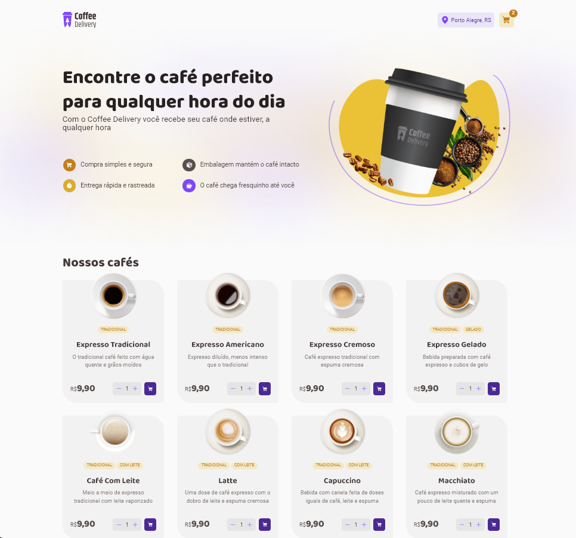

# Coffee Delivery

Bem-vindo ao README da aplicação Coffee Delivery! Esta é uma aplicação que simula um site de pedidos onde o usuário poderá adicionar produtos no carrinho e poderá confirmar seu pedido preenchendo os dados de entrega e selecionando a forma de pagamento.

#### Preview

#### Funcionalidades

1. Definição da quantidade desejada do produto.
2. Inclusão de itens no carrinho.
3. Visualização de itens no carrinho
4. Alteração do quantitativo de itens do carrinho. 
5. Remoção de itens do carrinho.
6. Input de dados de endereço para entrega através de formulário com validação.
7. Definição da forma de pagamento.
8. COnfirmação do pedido

### URL da Aplicação

   Ambiente de demonstração https://coffee-delivery-delta-seven.vercel.app/